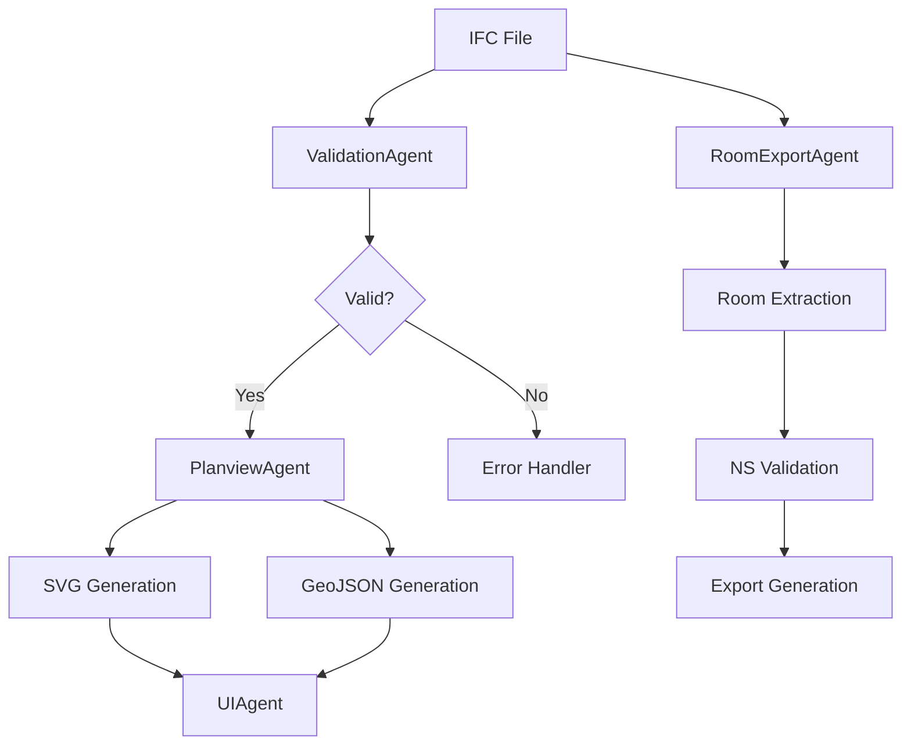

# Agent Steering Docs
_for IFC Planview & Room Schedule (MCP + Kiro Hooks)_

## 1) Purpose & Scope
- **Formål:** Sikre konsistent, trygg og målrettet atferd for agenter som jobber med IFC‑filer, 2D planview (SVG/GeoJSON) og romskjema‑eksport (JSON/PDF/XLSX).
- **Omfang:** PlanviewAgent, RoomExportAgent, ValidationAgent, UIAgent.  
- **Resultat:** Reproduserbare prosesser, standardisert feilhåndtering, målbare ytelseskrav og tydelige eskaleringsstier.

---

## 2) Agent Roles & Responsibilities

### PlanviewAgent
**Primæransvar:**
- Generere 2D planview fra IFC-filer (SVG + GeoJSON)
- Håndtere etasje-navigering og snitt-operasjoner
- Optimalisere rendering for interaktiv bruk
- Emittere Kiro hooks for observability

**Sekundæransvar:**
- Validere IFC-geometri før prosessering
- Cache mellomresultater for ytelse
- Rapportere metrics til monitoring-system

**Ikke ansvarlig for:**
- Romdata-ekstraksjon (RoomExportAgent sitt ansvar)
- UI-interaksjoner (UIAgent sitt ansvar)
- Fillagring utover temp-filer

### RoomExportAgent
**Primæransvar:**
- Ekstrahere romdata fra IFC Space-objekter
- Mappe til NS-standarder (NS 8360, NS 3940)
- Generere strukturerte romskjemaer (JSON/PDF/XLSX)
- Validere data mot forretningsregler

**Sekundæransvar:**
- Håndtere fallback-verdier for manglende data
- Optimalisere eksport for store datasett
- Integrere med validering-pipeline

**Ikke ansvarlig for:**
- Geometri-prosessering (PlanviewAgent sitt ansvar)
- UI-feedback (UIAgent sitt ansvar)
- Langtidslagring av filer

### ValidationAgent
**Primæransvar:**
- Validere IFC-filer mot standarder
- Sjekke NS-compliance for romdata
- Rapportere avvik og forslag til rettelser
- Kvalitetssikre eksporterte data

**Sekundæransvar:**
- Foreslå automatiske rettelser
- Prioritere kritiske vs. advarsler
- Integrere med Kiro hooks for varsling

### UIAgent
**Primæransvar:**
- Håndtere brukerinteraksjoner i planview
- Koordinere mellom backend-agenter og frontend
- Administrere tilstand for UI-komponenter
- Emittere brukerhandlinger som events

**Sekundæransvar:**
- Optimalisere responsivitet
- Håndtere offline-scenarios
- Administrere brukerpreferanser

---

## 3) Communication Protocols

### Inter-Agent Communication
```typescript
// Standardisert meldingsformat
interface AgentMessage {
  from: AgentType;
  to: AgentType;
  type: 'request' | 'response' | 'notification';
  correlationId: string;
  payload: any;
  timestamp: number;
  priority: 'low' | 'normal' | 'high' | 'critical';
}
```

### Event-Driven Coordination
- **Kiro Hooks** brukes for asynkron kommunikasjon
- **MCP Tools** brukes for direkte agent-til-agent kall
- **Shared State** administreres via Zustand stores

### Error Escalation Chain
1. **Agent Level**: Prøv automatisk recovery
2. **System Level**: Emit error event til Kiro hooks
3. **User Level**: Vis brukervenlig feilmelding
4. **Admin Level**: Log til monitoring system

---

## 4) Data Flow Standards

### IFC Processing Pipeline


### Data Validation Rules
- **IFC Files**: Må være valid IFC2x3 eller IFC4
- **Geometri**: Må ha minst ett IfcBuildingStorey
- **Romdata**: Må ha Name eller LongName for eksport
- **Koordinater**: Må være innenfor rimelige grenser

### Caching Strategy
- **IFC Parsing**: Cache parsed objekter i 1 time
- **Geometri**: Cache genererte shapes i 30 min
- **Romdata**: Cache ekstraherte data i 15 min
- **UI State**: Persist i localStorage

---

## 5) Error Handling Framework

### Error Categories
```typescript
enum ErrorCategory {
  VALIDATION = 'validation',
  PROCESSING = 'processing', 
  RENDERING = 'rendering',
  EXPORT = 'export',
  NETWORK = 'network',
  USER_INPUT = 'user_input'
}

enum ErrorSeverity {
  INFO = 'info',
  WARNING = 'warning', 
  ERROR = 'error',
  CRITICAL = 'critical'
}
```

### Recovery Strategies
- **Validation Errors**: Vis spesifikke feilmeldinger, foreslå rettelser
- **Processing Errors**: Prøv alternative algoritmer, reduser kvalitet
- **Rendering Errors**: Fallback til enklere visning
- **Export Errors**: Prøv alternative formater
- **Network Errors**: Retry med exponential backoff
- **User Input Errors**: Valider input, vis hjelpetekst

### Error Reporting
```typescript
// Standardisert feilrapportering
interface ErrorReport {
  category: ErrorCategory;
  severity: ErrorSeverity;
  code: string;
  message_no: string; // Norsk brukermelding
  message_en: string; // Engelsk teknisk melding
  context: Record<string, any>;
  stackTrace?: string;
  suggestedActions: string[];
  correlationId: string;
}
```

---

## 6) Performance Requirements

### Response Time Targets
- **IFC Loading**: < 5 sekunder for filer < 50MB
- **Planview Generation**: < 2 sekunder per etasje
- **Room Export**: < 500ms per rom
- **UI Interactions**: < 100ms response time
- **File Export**: < 10 sekunder for standard rapporter

### Memory Constraints
- **Max Memory Usage**: 2GB per agent instance
- **Memory Cleanup**: Automatisk cleanup etter 30 min inaktivitet
- **Large Files**: Stream processing for filer > 100MB

### Scalability Targets
- **Concurrent Users**: Støtte 50 samtidige brukere
- **File Size**: Håndtere IFC-filer opp til 500MB
- **Room Count**: Prosessere opp til 10,000 rom per eksport

---

## 7) Security Guidelines

### Data Protection
- **Sensitive Data**: Aldri logg personopplysninger
- **File Access**: Kun tilgang til autoriserte mapper
- **Network**: Kun HTTPS for eksterne kall
- **Caching**: Krypter sensitive cache-data

### Input Validation
- **File Uploads**: Valider filtype og størrelse
- **User Input**: Sanitiser alle brukerinput
- **API Calls**: Valider alle parametere
- **File Paths**: Forhindre path traversal

### Access Control
- **Agent Permissions**: Minste nødvendige rettigheter
- **File System**: Sandboxed tilgang til arbeidsområde
- **Network**: Whitelist for utgående forbindelser

---

## 8) Monitoring & Observability

### Key Metrics
```typescript
interface AgentMetrics {
  // Performance
  responseTime: number;
  throughput: number;
  errorRate: number;
  memoryUsage: number;
  
  // Business
  filesProcessed: number;
  roomsExported: number;
  userInteractions: number;
  
  // Quality
  validationErrors: number;
  recoveryAttempts: number;
  userSatisfaction: number;
}
```

### Kiro Hooks Integration
- **Performance Events**: Emit ved slow operations
- **Error Events**: Emit ved alle feil med context
- **Business Events**: Emit ved viktige milepæler
- **User Events**: Emit ved brukerinteraksjoner

### Alerting Rules
- **Critical**: Error rate > 5% i 5 min
- **Warning**: Response time > 2x target i 10 min
- **Info**: Memory usage > 80% i 15 min

---

## 9) Testing Strategy

### Unit Testing
- **Coverage Target**: > 80% for kritiske komponenter
- **Mock Strategy**: Mock eksterne avhengigheter
- **Test Data**: Bruk representative IFC-filer

### Integration Testing
- **Agent Communication**: Test meldingsutveksling
- **Data Flow**: Test hele pipeline end-to-end
- **Error Scenarios**: Test feilhåndtering

### Performance Testing
- **Load Testing**: Test med realistiske filstørrelser
- **Stress Testing**: Test grenser for system
- **Memory Testing**: Test for memory leaks

### User Acceptance Testing
- **Workflow Testing**: Test komplette brukerscenarios
- **Usability Testing**: Test brukeropplevelse
- **Compatibility Testing**: Test på forskjellige plattformer

---

## 10) Deployment & Configuration

### Environment Configuration
```typescript
interface AgentConfig {
  // Performance
  maxMemoryMB: number;
  timeoutSeconds: number;
  retryAttempts: number;
  
  // Features
  enableCaching: boolean;
  enableMetrics: boolean;
  enableHooks: boolean;
  
  // Integration
  mcpServers: string[];
  hookPlugins: string[];
  logLevel: 'debug' | 'info' | 'warn' | 'error';
}
```

### Deployment Checklist
- [ ] Konfigurer MCP-servere
- [ ] Aktiver Kiro hooks
- [ ] Sett opp logging
- [ ] Konfigurer caching
- [ ] Test alle integrasjoner
- [ ] Verifiser ytelse
- [ ] Aktiver monitoring

---

## 11) Troubleshooting Guide

### Common Issues

#### "IFC file won't load"
**Symptoms**: Loading spinner never stops
**Causes**: Invalid IFC format, file too large, network issues
**Solutions**:
1. Validate IFC file with external tool
2. Check file size (max 500MB)
3. Check network connectivity
4. Try different IFC version

#### "Planview rendering is slow"
**Symptoms**: > 5 seconds to render
**Causes**: Complex geometry, memory pressure, inefficient algorithms
**Solutions**:
1. Enable geometry simplification
2. Increase memory allocation
3. Use level-of-detail rendering
4. Cache intermediate results

#### "Room export fails"
**Symptoms**: Export button doesn't work
**Causes**: Missing room data, validation errors, format issues
**Solutions**:
1. Check room data completeness
2. Review validation errors
3. Try different export format
4. Use fallback values

### Debug Tools
- **Event Monitor**: Real-time event visualization
- **Performance Profiler**: Identify bottlenecks
- **Memory Inspector**: Track memory usage
- **Log Analyzer**: Search and filter logs

---

## 12) Best Practices

### Code Quality
- **TypeScript**: Bruk strict mode
- **Error Handling**: Alltid håndter errors gracefully
- **Logging**: Logg på riktig nivå med context
- **Testing**: Skriv tester før implementering

### Performance
- **Lazy Loading**: Last kun det som trengs
- **Caching**: Cache dyre operasjoner
- **Streaming**: Bruk streaming for store filer
- **Debouncing**: Debounce brukerinteraksjoner

### User Experience
- **Feedback**: Gi umiddelbar feedback på handlinger
- **Progress**: Vis fremdrift for lange operasjoner
- **Errors**: Vis konstruktive feilmeldinger
- **Help**: Tilby kontekstuell hjelp

### Maintainability
- **Documentation**: Dokumenter komplekse algoritmer
- **Refactoring**: Refaktorer regelmessig
- **Dependencies**: Hold avhengigheter oppdatert
- **Monitoring**: Overvåk systemhelse kontinuerlig

---

## 13) Future Roadmap

### Short Term (1-3 måneder)
- Implementer avanserte planview-features
- Utvid romskjema-eksport med flere formater
- Forbedre ytelse for store filer
- Legg til mer omfattende validering

### Medium Term (3-6 måneder)
- AI-assistert kvalitetskontroll
- Automatisk geometri-reparasjon
- Avanserte visualiseringsalternativer
- Integrering med eksterne systemer

### Long Term (6+ måneder)
- Machine learning for optimalisering
- Cloud-basert prosessering
- Collaborative editing
- Mobile app support

---

## 14) Compliance & Standards

### IFC Standards
- **IFC2x3**: Full støtte for TC1
- **IFC4**: Støtte for ADD2 TC1
- **IFC4.3**: Planlagt støtte

### Norwegian Standards
- **NS 8360**: Bygningsdeler og bygningstyper
- **NS 3940**: Areal- og volumberegninger
- **NS-EN ISO 19650**: BIM-prosesser

### Quality Assurance
- **ISO 9001**: Kvalitetsledelse
- **ISO 27001**: Informasjonssikkerhet
- **GDPR**: Personvernforordningen

---

## 15) Glossary

**Agent**: Autonom programvarekomponent med spesifikt ansvar
**Kiro Hooks**: Event-drevet system for observability
**MCP**: Model Context Protocol for agent-kommunikasjon
**Planview**: 2D-representasjon av bygningsplan
**Room Schedule**: Strukturert oversikt over rom og egenskaper
**Correlation ID**: Unik identifikator for å spore relaterte operasjoner
**Fallback**: Alternative løsning når primær løsning feiler
**Sanitization**: Rensing av data for sikkerhet
**Debouncing**: Teknikk for å redusere hyppige kall

---

*Sist oppdatert: [Dagens dato]*
*Versjon: 1.0*
*Eier: Kiro Development Team*