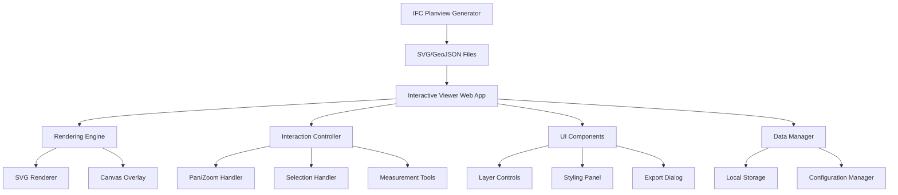

# Design Document

## Overview

The interactive planview system will be built as a web-based application that renders and manipulates 2D planviews generated from IFC files. The system will use a modern web stack with SVG-based rendering for scalability and precision, complemented by HTML5 Canvas for performance-critical operations like measurements and overlays.

The architecture follows a modular approach with separate concerns for rendering, interaction handling, data management, and UI controls. The system will be built as a single-page application (SPA) that can be embedded in larger applications or used standalone.

## Architecture

### High-Level Architecture



### Technology Stack

- **Frontend Framework**: React 18+ with TypeScript for type safety and component architecture
- **Rendering**: SVG for vector graphics with D3.js for manipulation and Canvas API for overlays
- **State Management**: Zustand for lightweight state management
- **Styling**: Tailwind CSS for responsive design and component styling
- **Build Tool**: Vite for fast development and optimized builds
- **Testing**: Vitest for unit tests and Playwright for E2E testing

### Data Flow

1. **Input Processing**: SVG/GeoJSON files are loaded and parsed into internal data structures
2. **Rendering Pipeline**: Data is transformed into renderable SVG elements with associated metadata
3. **Interaction Layer**: User interactions are captured and translated into state changes
4. **Update Cycle**: State changes trigger re-rendering of affected components
5. **Export Pipeline**: Current view state is serialized for export in various formats

## Components and Interfaces

### Core Components

#### 1. PlanviewViewer (Main Container)
```typescript
interface PlanviewViewerProps {
  svgData: SVGData;
  geoJsonData?: GeoJSONData;
  initialConfig?: ViewerConfig;
  onElementClick?: (element: IFCElement) => void;
  onMeasurement?: (measurement: Measurement) => void;
}
```

**Responsibilities:**
- Orchestrates all child components
- Manages global viewer state
- Handles file loading and parsing
- Provides context for child components

#### 2. RenderingEngine
```typescript
interface RenderingEngine {
  loadSVG(svgData: SVGData): void;
  updateElementVisibility(classFilter: IFCClassFilter): void;
  updateElementStyling(styleConfig: StyleConfig): void;
  getElementAt(coordinates: Point): IFCElement | null;
  exportView(format: ExportFormat, options: ExportOptions): Blob;
}
```

**Responsibilities:**
- SVG DOM manipulation and optimization
- Layer visibility management
- Dynamic styling application
- Hit testing for element selection
- View export functionality

#### 3. InteractionController
```typescript
interface InteractionController {
  enablePanZoom(): void;
  disablePanZoom(): void;
  setMeasurementMode(enabled: boolean): void;
  handleElementClick(event: MouseEvent): void;
  handleTouch(event: TouchEvent): void;
}
```

**Responsibilities:**
- Pan and zoom gesture handling
- Touch event processing
- Measurement tool coordination
- Element selection management

#### 4. LayerControlPanel
```typescript
interface LayerControlPanelProps {
  availableLayers: IFCClass[];
  visibleLayers: Set<string>;
  onLayerToggle: (className: string, visible: boolean) => void;
  onShowAll: () => void;
  onHideAll: () => void;
}
```

**Responsibilities:**
- IFC class visibility controls
- Bulk layer operations
- Layer search and filtering

#### 5. StylingPanel
```typescript
interface StylingPanelProps {
  selectedClass?: string;
  currentStyles: StyleConfig;
  onStyleChange: (className: string, style: ElementStyle) => void;
  onResetStyles: () => void;
}
```

**Responsibilities:**
- Real-time style editing
- Color and line width controls
- Style preset management

### Data Models

#### IFCElement
```typescript
interface IFCElement {
  guid: string;
  ifcClass: string;
  geometry: SVGGeometry;
  properties: Record<string, any>;
  bounds: BoundingBox;
  visible: boolean;
  style: ElementStyle;
}
```

#### ViewerState
```typescript
interface ViewerState {
  transform: Transform;
  visibleLayers: Set<string>;
  selectedElement?: IFCElement;
  measurementMode: boolean;
  measurements: Measurement[];
  styleOverrides: Map<string, ElementStyle>;
  splitViewMode: boolean;
  currentStorey: string;
}
```

#### Configuration
```typescript
interface ViewerConfig {
  enableMeasurements: boolean;
  enableExport: boolean;
  enableSplitView: boolean;
  touchEnabled: boolean;
  defaultStyles: StyleConfig;
  exportFormats: ExportFormat[];
}
```

## Data Models

### SVG Processing Pipeline

The system will process SVG files generated by the IFC planview generator:

1. **SVG Parsing**: Parse SVG DOM and extract individual path elements
2. **Metadata Extraction**: Extract IFC class information from element attributes or classes
3. **Spatial Indexing**: Build spatial index (R-tree) for efficient hit testing
4. **Style Normalization**: Convert inline styles to manageable style objects
5. **Layer Organization**: Group elements by IFC class for layer management

### GeoJSON Integration

When GeoJSON data is available:

1. **Coordinate Transformation**: Convert GeoJSON coordinates to SVG coordinate space
2. **Property Mapping**: Map GeoJSON properties to IFC element metadata
3. **Geometry Conversion**: Convert GeoJSON LineString/MultiLineString to SVG paths
4. **Synchronization**: Maintain consistency between SVG and GeoJSON representations

### State Management Architecture

Using Zustand for predictable state management:

```typescript
interface ViewerStore {
  // State
  elements: Map<string, IFCElement>;
  viewerState: ViewerState;
  
  // Actions
  loadPlanview: (svgData: SVGData, geoJsonData?: GeoJSONData) => void;
  toggleLayer: (className: string) => void;
  updateElementStyle: (className: string, style: ElementStyle) => void;
  setTransform: (transform: Transform) => void;
  selectElement: (element?: IFCElement) => void;
  addMeasurement: (measurement: Measurement) => void;
  saveConfiguration: (name: string) => void;
  loadConfiguration: (name: string) => void;
}
```

## Error Handling

### Error Categories

1. **Loading Errors**: Invalid SVG/GeoJSON files, network issues
2. **Rendering Errors**: SVG parsing failures, memory constraints
3. **Interaction Errors**: Invalid measurements, export failures
4. **Configuration Errors**: Invalid presets, storage quota exceeded

### Error Recovery Strategies

- **Graceful Degradation**: Continue operation with reduced functionality
- **User Feedback**: Clear error messages with suggested actions
- **Automatic Retry**: Retry failed operations with exponential backoff
- **Fallback Modes**: Alternative rendering methods for problematic content

### Error Handling Implementation

```typescript
interface ErrorHandler {
  handleLoadingError(error: LoadingError): void;
  handleRenderingError(error: RenderingError): void;
  handleInteractionError(error: InteractionError): void;
  showUserMessage(message: string, type: 'error' | 'warning' | 'info'): void;
}
```

## Testing Strategy

### Unit Testing

- **Component Testing**: Test individual React components in isolation
- **Utility Functions**: Test mathematical calculations, coordinate transformations
- **State Management**: Test Zustand store actions and state transitions
- **Data Processing**: Test SVG parsing and GeoJSON conversion

### Integration Testing

- **Rendering Pipeline**: Test complete SVG loading and rendering process
- **Interaction Flows**: Test pan/zoom, selection, and measurement workflows
- **Export Functionality**: Test various export formats and options
- **Configuration Management**: Test preset saving and loading

### End-to-End Testing

- **User Workflows**: Test complete user journeys from loading to export
- **Cross-Browser Compatibility**: Test on major browsers and devices
- **Performance Testing**: Test with large planview files
- **Accessibility Testing**: Test keyboard navigation and screen reader support

### Performance Testing

- **Load Testing**: Test with various file sizes and complexity
- **Memory Usage**: Monitor memory consumption during long sessions
- **Rendering Performance**: Measure frame rates during interactions
- **Mobile Performance**: Test on various mobile devices and orientations

### Test Data Strategy

- **Sample Files**: Create test SVG/GeoJSON files of varying complexity
- **Mock Data**: Generate synthetic data for edge cases
- **Real-World Data**: Use actual IFC-generated planviews for realistic testing
- **Error Scenarios**: Create malformed files to test error handling